### Escuela Colombiana de Ingeniería

### Arquitecturas Empresariales


#### TALLER 6: TALLER DE TRABAJO INDIVIDUAL EN PATRONES ARQUITECTURALES

#### Santiago Arévalo Rojas

### Instrucciones para ejecución
Para ejecutar la aplicación dentro de una instancia EC2 se deben seguir los siguientes pasos:

1. Nos conectamos a una instancia EC2 que ya hayamos creado previamente, para eso lo hacemos por medio del protocolo ssh y con nuestra llave privada, en mi caso el comando luce:
    ```ssh -i "dockerprimerweb.pem" ec2-user@ec2-3-81-96-95.compute-1.amazonaws.com```  
2. Una vez dentro encontramos nuestra máquina virtual:  
    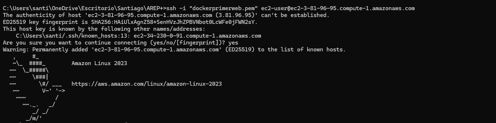  
3. Ponemos a correr docker y creamos una nueva red docker con el comando:
    ```docker network create log_network```
4. Para luego proceder a ejecutar los contenedores, en caso en que no se hayan bajado las imagenes, docker lo hará de manera automática, iniciamos poniendo a correr el contenedor de la base de datos mongo:  
    ```docker run -d --network=log_network -p 27017:27017 --name mongodb mongo```  
5. Ahora proseguimos a ejecutar los contenedores de los logservice:  
    ```docker run -d --network=log_network -p 35001:46001 --name logservice1 santiarojas18/logservice1```  
    ```docker run -d --network=log_network -p 35002:46002 --name logservice2 santiarojas18/logservice2```  
    ```docker run -d --network=log_network -p 35003:46003 --name logservice3 santiarojas18/logservice3```  
6. Y ahora corremos el contenedor del servidor fachada:  
    ```docker run -d --network=log_network -p 35000:46000 --name weblogroundrobin santiarojas18/weblogroundrobin```
7. Una vez bajadas las imagenes y ejecutados los conetenedores podremos acceder a la aplicación por medio del DNS de la máquina virtual, para entrar a la página en mi caso es por medio de la URL [http://ec2-3-81-96-95.compute-1.amazonaws.com:35000/logform.html](http://ec2-3-81-96-95.compute-1.amazonaws.com:35000/logform.html), y se ve la siguiente página web:  
    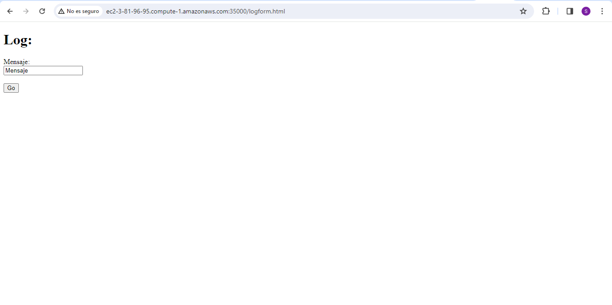  
8. Para ingresar un nuevo log basta con escribir en el campo y darle click al botón go, que se encargará de mandar el mensaje e imprimir los últimos 10 mensajes del log, aquí hemos enviado nuestro primer mensaje:  
    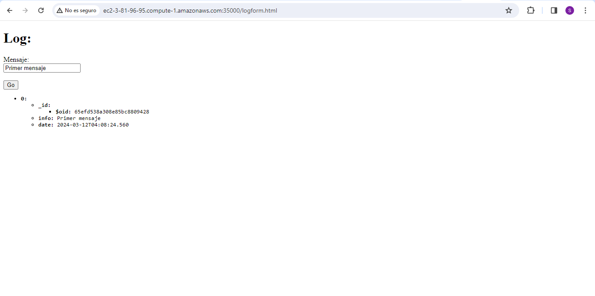  
9. Podemos hacer pruebas desde Postman, para verificar que los 3 servidores de logServices están funcionando correctamente, haciendo la prueba al servidor 1, que corre por el puerto 35001:  
    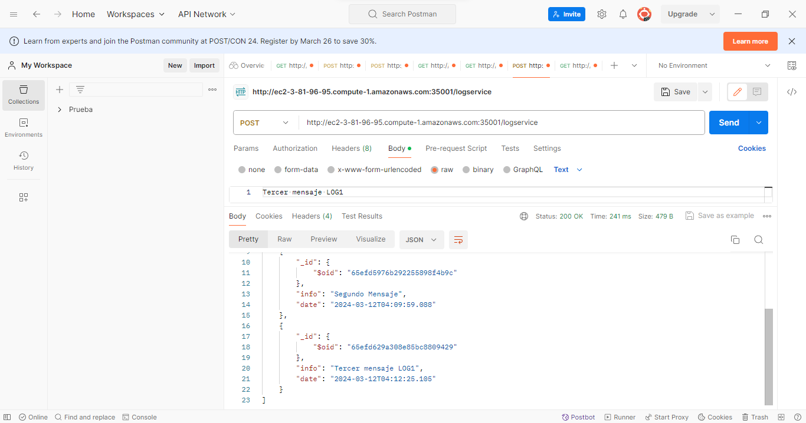  
10. Ahora al servidor 2, que corre por el puerto 35002:  
    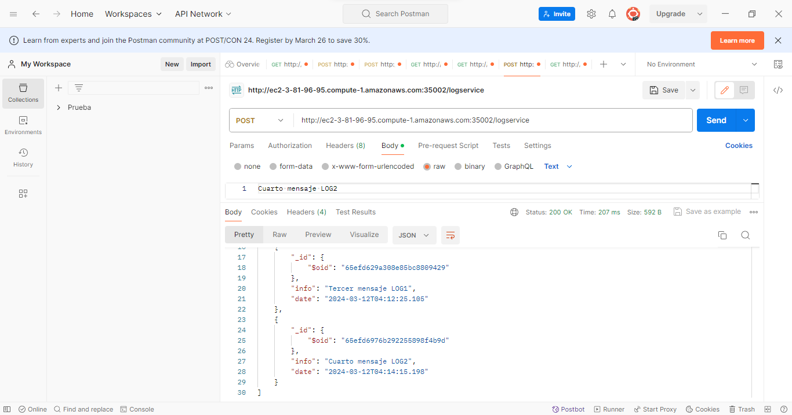  
11. Finalmente, al servidor 3, que corre por el puerto 35003:  
    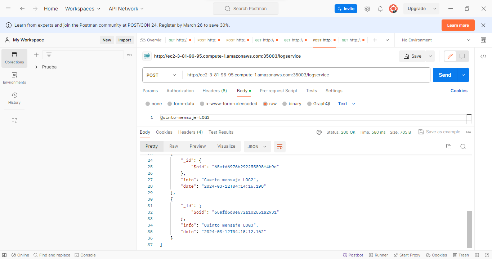  
12. Luego, al realizar otra solicitud desde el browser, evidenciamos el correcto funcionamiento:  
    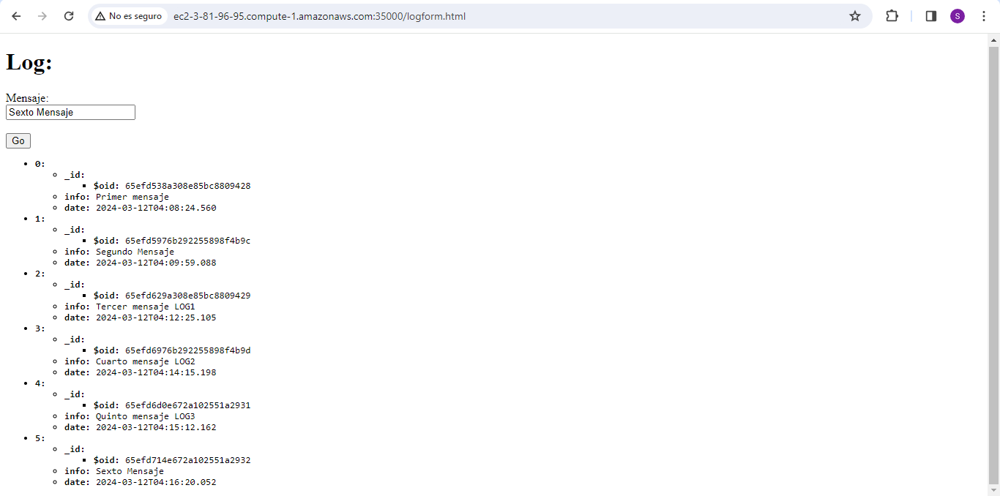  
13. Hacemos 4 solicitudes más, para verificar que efectivamente solo trae las 10 últimas, en donde vemos que en la petición once muestra efectivamente los mensajes desde el 2 hasta el 11:  
    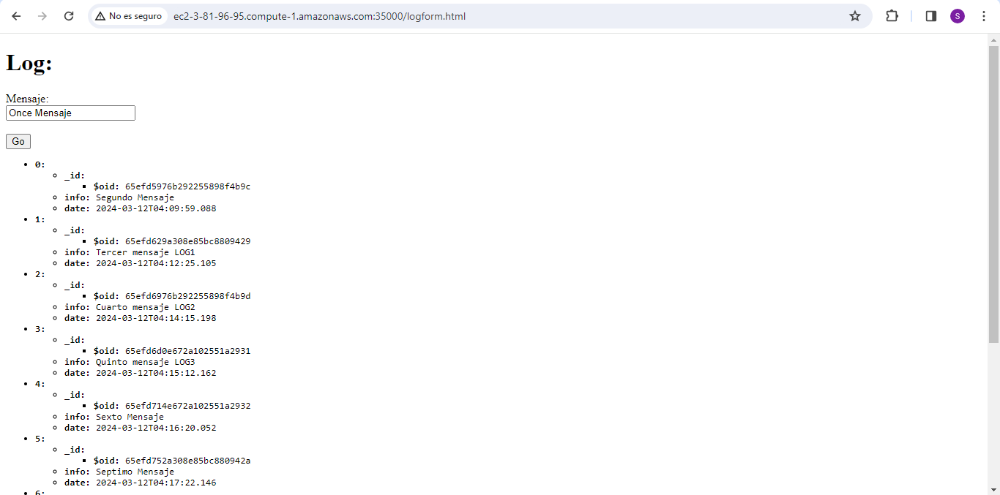  
    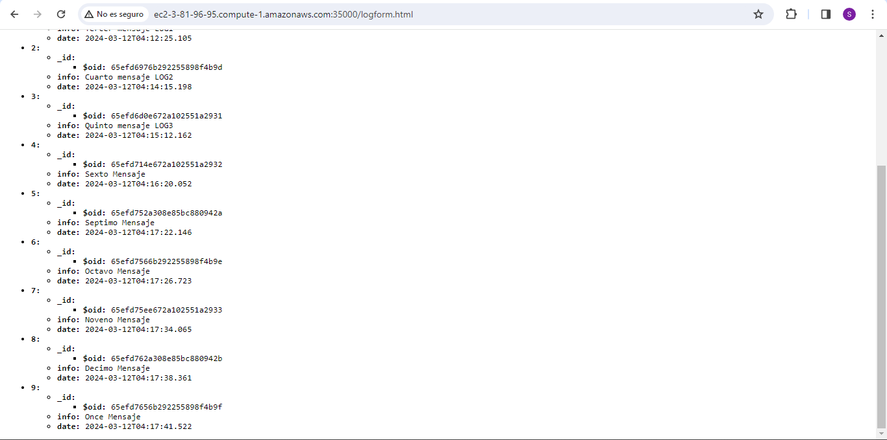  

### Información del diseño  

* La arquitectura que se siguió fue la siguiente propuesta:
    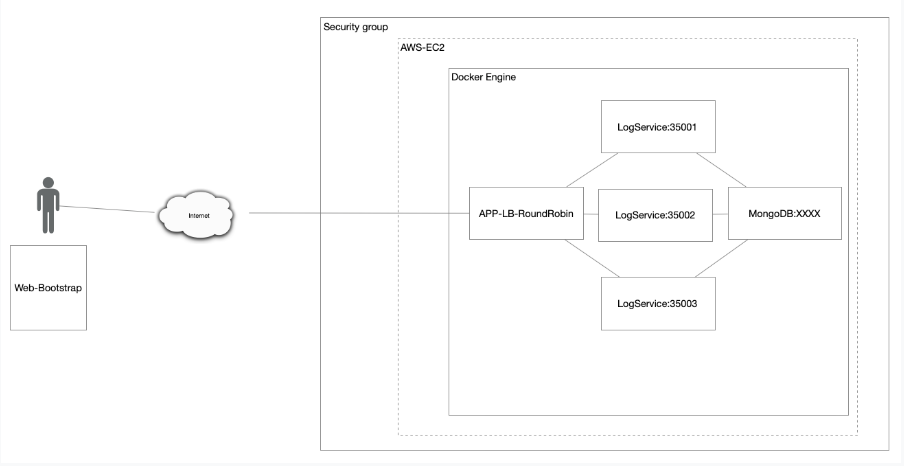  
* Para esto se creó primero un servidor fachada, llamado Weblogroundrobin, que es el encargado de ofrecer la página web y el servicio REST post que se comunica con los logService, por medio de la clase RRInvoker. Para cumplir con el algoritmo de RoundRobin en la fachada, bastó con utilizar un arreglo donde se tuvieran las URL de los 3 servidores que iban a atender nuestras solicitudes e ir cambiando entre cada una de estas de manera secuencial, el algoritmo luce así:  
    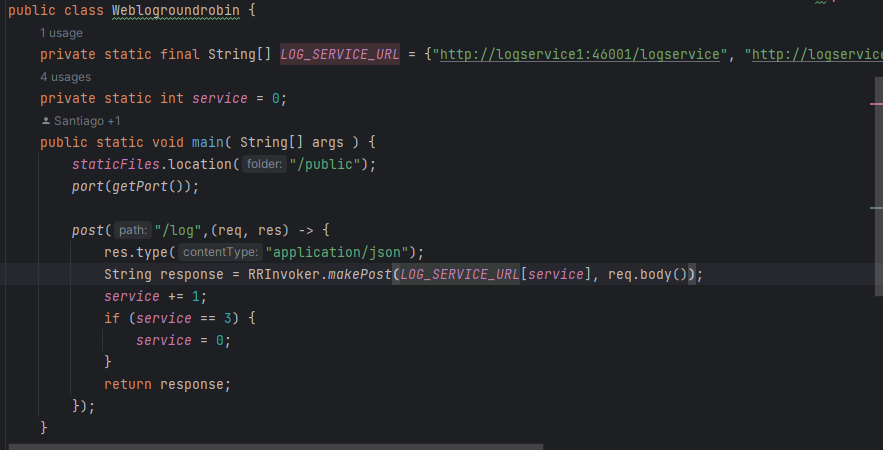  
* Como vimos en la imagen anterior, desde la fachada le enviamos la URL y el body, al RRInvoker, que se iba a enviar para que el logService elegido lo enviara a la base de datos y retornara los últimos 10.
* En cuanto a la base de datos se decidió por una no relacional, en específico mongodb, que como vimos también fue utilizada por medio de contenedores.
* Para la conexión a la base de datos se hizo uso de una clase de conexión llamada MongoUtil y aparte la clase LogDAO para poder guardar los objetos.
* Finalmente, para poner en contenedores se realizaron distintos Dockerfile, en los que se especificó el puerto de cada uno de los servidores.

### Video funcionamiento

En el siguiente [video](img/LAB6Video.mp4) se puede observar la aplicación en funcionamiento.
